## Milestone Project Three | Project Pal
 
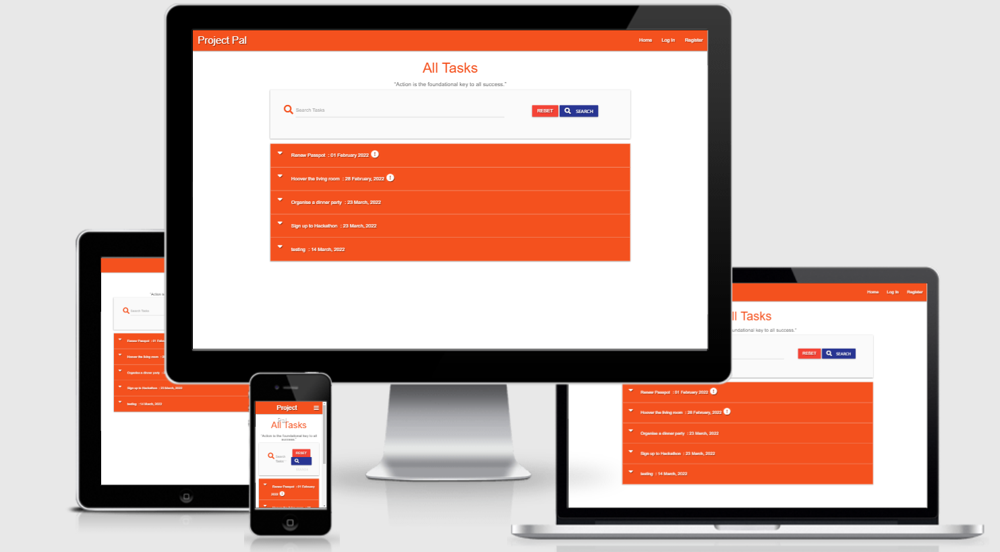
 
[Live website can be viewed here](https://flask-tsk-manager.herokuapp.com/)
 
## About
This website has been created for my Milestone 3 Data Centric Development project.I took inspiration from Codes Institute Task Manager Mini Project. As I struggled with learning python I decided I would take the concept and develop a project planner called 'Project Pal' that is specifically created to help manage tasks with Code Institutes Milestone Projects and Hackathons.
 
## Table of Contents
* [User Experience](#User-Experience)
   * [Site owner goals](#site-owner-goals)
   * [User Stories](#User-Stories)
   * [First Time Visitor Goals](#First-Time-Visitor-Goals)
   * [First Time Visitor Goals for Admins](#First-Time-Visitor-Goals-for-Admins)
   * [Returning Visitor Goals](#Returning-Visitor-Goals)
* [Design](#Design)
   * [Colors](#Colors)
   * [Wireframes](#Wireframes)
   * [Typography](#Typography)
* [Features](#Features)
* [Future Features](#Future-Features)
* [Technologies](#Technologies)
   * [Languages](#Languages)
   * [Frameworks & Tools](#Frameworks-&-Tools)
* [Testing](#Testing)
    * [Validation](Validation)
    * [Performance](Performance)
    * [User Stories](User-story-testing)
* [Deployment](#Deployment)
* [Credits](#Credits)
* [Acknowledgements](#Acknowledgements)
 
## User Experience
 
### Site Owner Goals:
* As a site owner I want to create an attractive, responsive, easy to use task manager
* As a site owner I want to create an application to work as intended, Create, Read, Update & Delete
* As a site owner I want to create an application that is easy to navigate
* As a site owner I was to create a site with different functionality for users and admins
 
### User Stories:
 
**First Time Visitor Goals for Users**
* As a first time visitor, I want to be able to register and login easily.
* As a first time visitor, I want the application to be attractive and easy to read.
* As a first time visitor, I want the application to be responsive to whichever device I am using it on.
* As a first time visitor, I want to be able to navigate around the different pages of the application easily.
* As a first time visitor, I want to be able to clearly see my tasks that I have to do .
* As a first time visitor, I want to be given a choice of categories to add tasks to
* As a first time visitor, I want to be able Create, Read, Update & Delete tasks
 
**First Time Visitor Goals for Admins**
* As a first time visitor, I want the application to be attractive and easy to read.
* As a first time visitor, I want the application to be responsive to whichever device I am using it on.
* As a first time visitor, I want to be able to navigate around the different pages of the application easily.
* As a first time visitor, I want to be able to manage categories for the task manager.
* As a first time visitor, I want to be able to clearly see my tasks that I have to do .
* As a first time visitor, I want to be given a choice of categories to add tasks to
 
**Returning Visitor Goals:**
* As a returning user, I want to be able to see my tasks cleary
* As a returning user, I want to be able delete completed tasks
* As a returning user, I want to be able to see add tasks cleary
* As a returning user, I want to login easily
* As a returning user, I want to navigate around the application easily
* As a returning user, I want to navigate search for tasks
 
### Design:
* The design of the website was chosen with the application in mind. It was designed to be visually pleasing for users with an easy UX. The colors were chosen with two established brands in mind, ‘Code Institute’ and ‘Hubspot’. Since the project was created to manage Milestone projects and Hupspot has a great ‘Task Manager’ the inspiration was taken from these brands which have a similar color palette.
 
### Colors
* I created a color scheme of deep-orange and indigo. Deep-orange and indigo are bold strong colors and each other against the white background.
 
   * 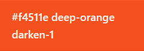
   * 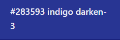
 
### Wireframes
* Balsamiq was used to create the wireframes for desktop, mobile and tablet.
 
* The finished website is the same as the original wireframes.
 
* The links to each one can be found here:
 * Reister
 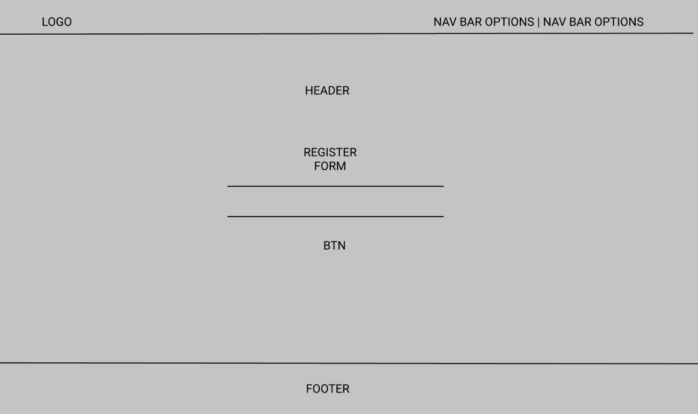
 
 * Login
 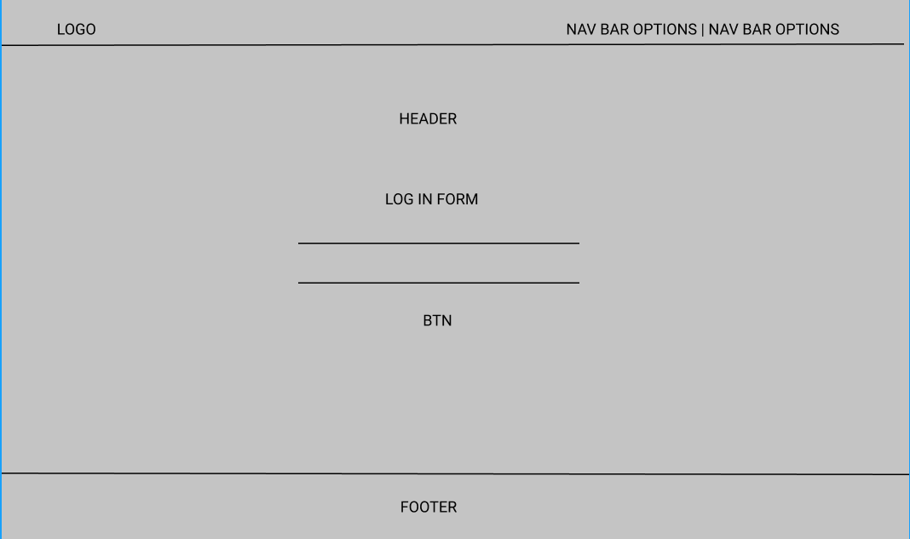
 
 * Profile
 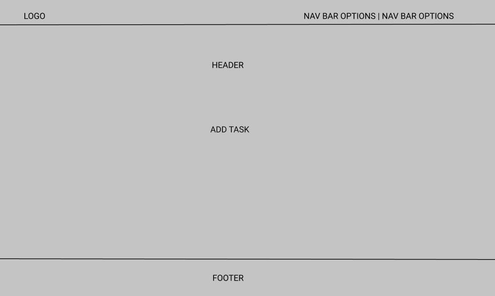
 
 * Home
 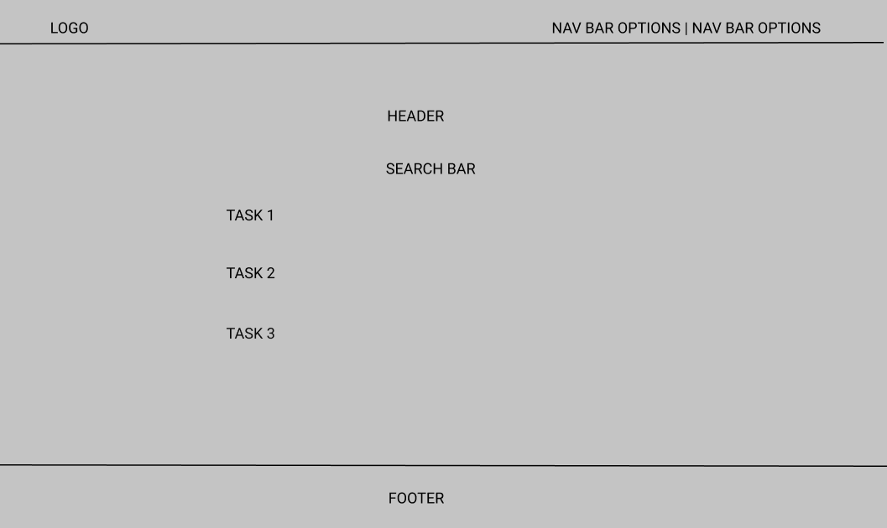
 
 * All Tasks
 
 
 * Manage Categories
 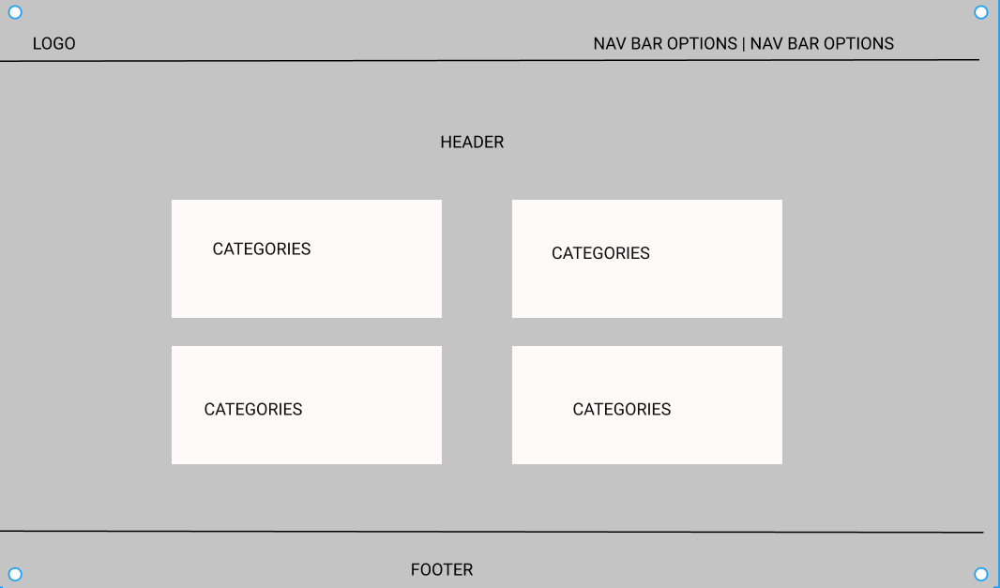

 ### Structure

   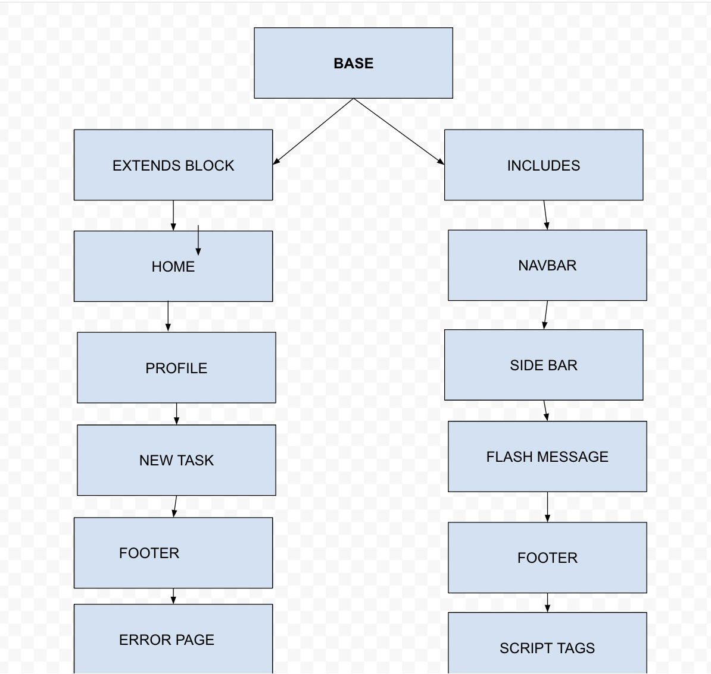

* Jinja Template Structure/Relationships
   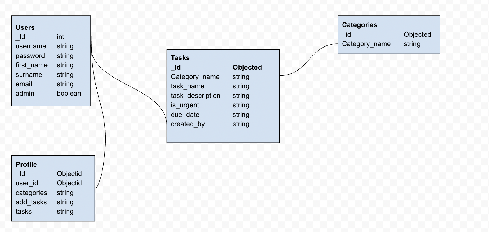
 
### Typography
* I chose 'Poppins' from Google Fonts. I chose this font because:
 
* Each letterform is nearly monolinear, with optical corrections applied to stroke joints where necessary to maintain an even typographic color, which I thought was fitting. It's also a sans-serif font which is more accessible for people with dyslexia. Sans-serif is the back-up font if poppins fails.
 
### Features
 
**Register page**
 * Nav bar
   * With restricted views for non registered users
 * A motivating productivity quote
   * To provide motivation
 * Register form
   * With required fields to ensure correct and validate registration
 * Redirect users to login page
   * Feature added to ensure clear and easy navigation around the site
 * Footer
   * Social media | Articles 
 
**Login page**
* Nav bar
   * With restricted views until users are logged in
* A motivating productivity quote
   * To provide motivation
* Register form
   * With required fields to ensure correct and validate registration
* Redirect users to register page
   * Feature added to ensure clear and easy navigation around the site
* Footer
   * Social media | Articles
 
**Home Page**
* A Navbar
   * To navigate through the application
* A search bar
   * To easily search for tasks
* A motivating productivity quote
   * To provide motivation
* Task list with python automation
   * Automatically updates with tasks are added or completed
* Footer
   * Social media | Articles
 
**Profile page**
* A Navbar
   * To navigate through the application
* Display option for ‘User Name’
  * To personalize the experience
* Add Task Btn
  * Replicated the Btn here for convenience
* A motivating productivity quote
  * To provide motivation
* Footer
   * Social media | Articles
 
**New task**
* A Navbar
  * To navigate through the application
* A motivating productivity quote
  * To provide motivation
* Card panel with prompts to add tasks and task information
  * Includes materialize ‘Due date picker’ and ‘Urgent’ switch
* Add task btn
  * Btn updates the task on the ‘Home’ task list
* Footer
   * Social media | Articles
 
**Manage Categories**
* A motivating productivity quote
   * To provide motivation
* Add task btn
   * Btn updates the category on the manage category pages and in the ‘choose category’ option when adding a task with ‘edit’ and ‘delete’ btns
* Footer
   * Social media | Articles
 
**Log out page**
* Flash message
   * You have been logged out
* Login form
   * For users to log back in
* Redirect users to register page
   * Feature added to ensure clear and easy navigation around the site
* Footer
   * Social media | Articles
 
### Future Features
* Include an API that will automate and update positive quotes on each page of the application
* Include the option to add sub-tasks per task with the option to tick off subtask as they are completed
* Include an ‘About’ page with a mission statement and a section on productivity and motivation to work better
* Allow users to add a profile image to their account.
* Allow the user to edit their username or password
* Allow more than one Admin by not just using the Admin username.
* Using emailJS gives the user the option to sign up to a newsletter and receive emails relevant to the site.
* Allow any user to add a further review to any review already added on the site.
* Increase the applications accessibility score
 
### Technologies used
 
* Languages used
 * [HTML5](https://en.wikipedia.org/wiki/HTML5)
 * [CSS3](https://developer.mozilla.org/en-US/docs/Web/CSS)
 * [JavaScript](https://en.wikipedia.org/wiki/JavaScript)
 * [Python](https://en.wikipedia.org/wiki/Python_(programming_language)
 
### Frameworks, Libraries and Programs Used
 
* [Materialize](https://materializecss.com/)
  * Materialize was used to help build the structure of the website and add responsiveness across different screen sizes. It also supplied some styling and built in components such as the modal.
* [FIGMA](https://www.figma.com/)
  * I used balsamiq to design and draw up my wireframes before starting the project.
* [Font Awesome](https://fontawesome.com/)
  * Font awesome was used to add all icons used on the site.
* [Gitpod](https://www.gitpod.io/)
  * Gitpod was the text editor I used for this project.
* [Git](https://www.gitpod.io/)
 * Git is used as version control software to add, commit and push code to my GitHub repository where the code is then stored.
* [GitHub](https://github.com/)
 * I have used GitHub as a remote repository to push and store the committed changes to my project from Git.
* [jQuery](https://en.wikipedia.org/wiki/JQuery)
 * jQuery was used to initialize Materialize and for some of the sites functionality.
* [Google Chrome Developer Tools](https://developer.chrome.com/docs/devtools/)
 * I have used Google chromes built in developer tools to help with the styling of the site, selecting colors and to help fix any bugs I found.
* [Heroku](https://www.heroku.com/)
 * Heroku has been used to deploy my live site.
* [Flask](https://flask.palletsprojects.com/en/2.0.x/)
 * Flask was used as the web framework for the application.
* [MongoDB](https://www.mongodb.com/)
 * MongoDB was used to hold the database for my project.
* [Werkzeug](https://werkzeug.palletsprojects.com/en/2.0.x/)
 * Werkzeug was used for password hashing and authentication.
* [Jinja](https://jinja.palletsprojects.com/en/3.0.x/)
 * Jinja templating language was used to simplify and display backend data in HTML.
* [Google Fonts](https://fonts.google.com/)
  * Google fonts were used to import the 'Poppins' font into the style.css file which is used on all pages throughout the project.
* [Am I responsive](http://ami.responsivedesign.is/)
   * This was used to check responsiveness on different screen sizes and create the showcase image for the project.
* [Google Lighthouse](https://developers.google.com/web/tools/lighthouse)
  * Google lighthouse was used to test the performance of my site.
* [The W3C Markup Validation Service](https://validator.w3.org/)
  * The validation tool to check for HTML errors.
* [The W3C CSS Validation Service](https://jigsaw.w3.org/css-validator/)
  * The validation tool to check for CSS errors.
* [Color contrast](https://wave.webaim.org/report#/https://tararhoseyn.github.io/CardiffSwimCentreMS1/)
  * Color tool used to compare colors for the website.
* [Online JavaScript Beautifier](https://beautifier.io/)
  * Tool to help format the javascript code
* [Python Beautifier](https://codebeautify.org/python-formatter-beautifier)
  * Tool used to help format the python code
 
## Testing
 
### CSS Validation
* To test my CSS code I used the [The W3C CSS Validation Service](https://jigsaw.w3.org/css-validator/)
* There were no issues found
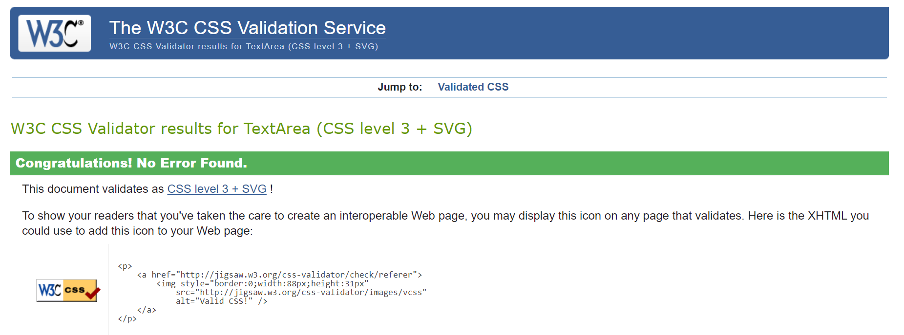
 
### HTML Validation
* To test my HTML code I used the [The W3C Markup Validation Service](https://validator.w3.org/)
* There were no issues found
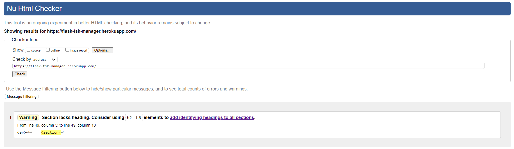
 
### Pep8 validation
 * To test my python code I used the [pep8 Validator](http://pep8online.com/)
 * There were no issues found
 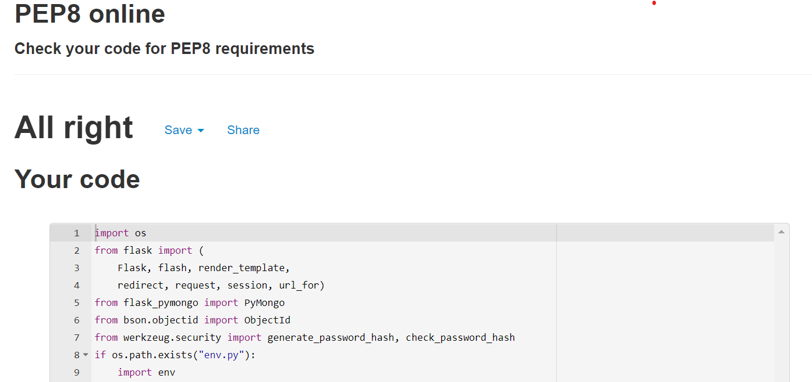
 
## Performance
* Google Lighthouse was used to measure the performance and speed of the website
 
### Lighthouse testing
* I ran my pages through the google lighthouse tester to check the performance of my pages. The results can be seen in the images below. The results were overall pretty good with most of the scores being 90 and above. With performance getting 100 on four out of the five pages tested. The score that seemed to generate the lowest mark overall was accessibility. Upon investigation, it seems the white background was causing this issue. I have noted in my future features section to adjust the white background in the future.
 
* Register page
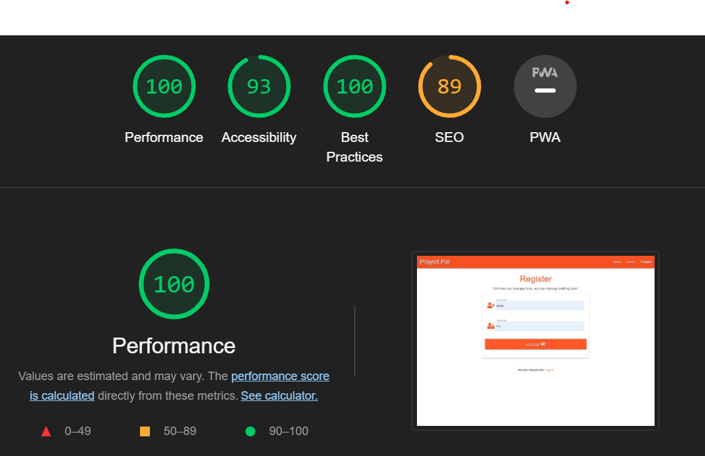
 
* Login page
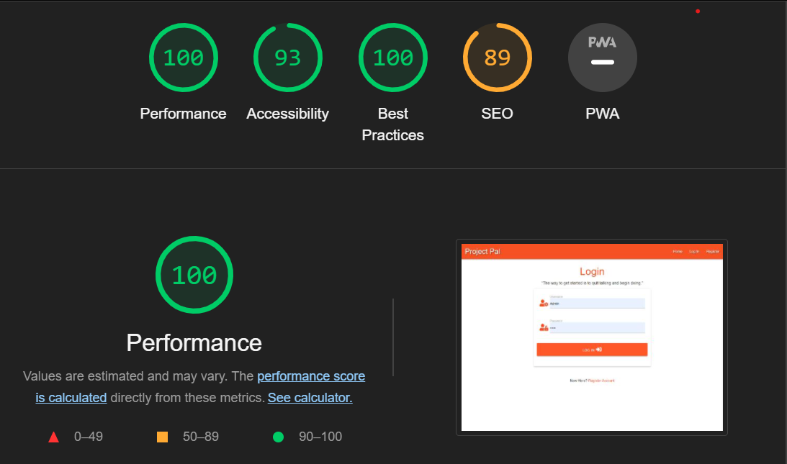
 
* Home page
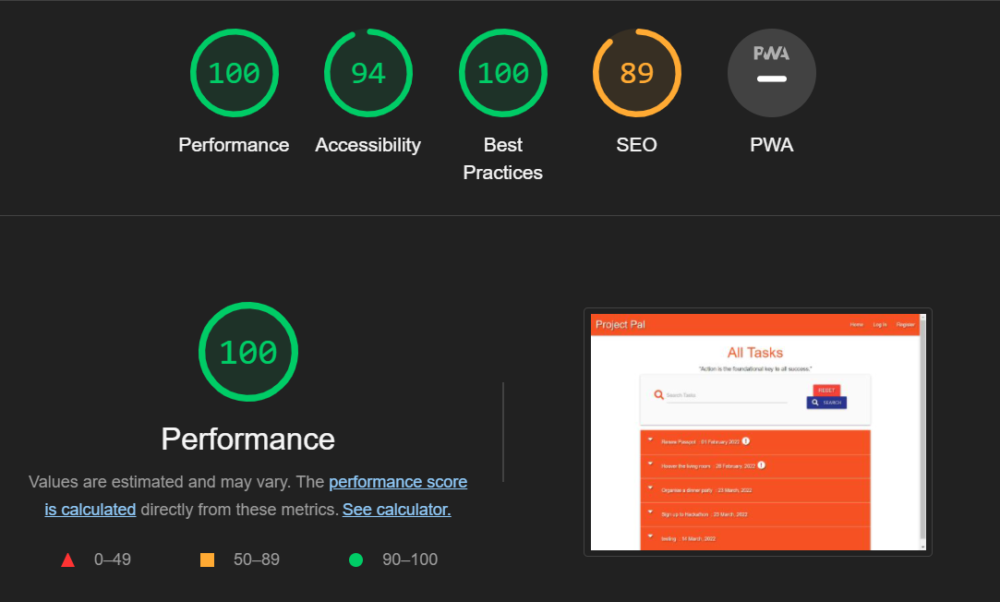
 
* Profile page
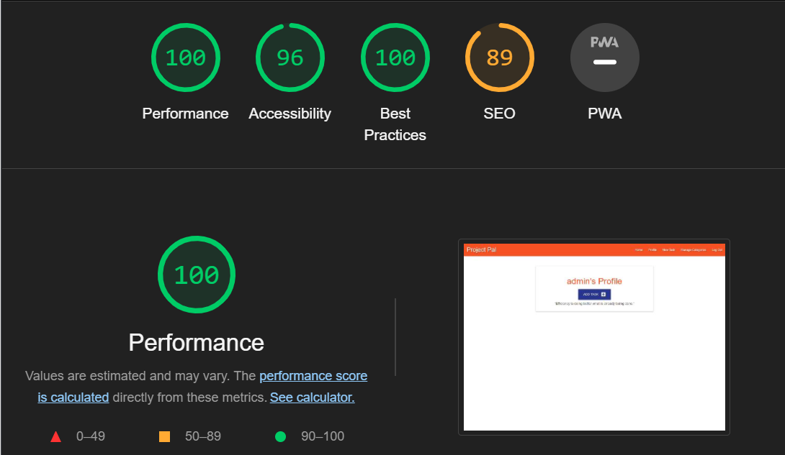
 
* New task
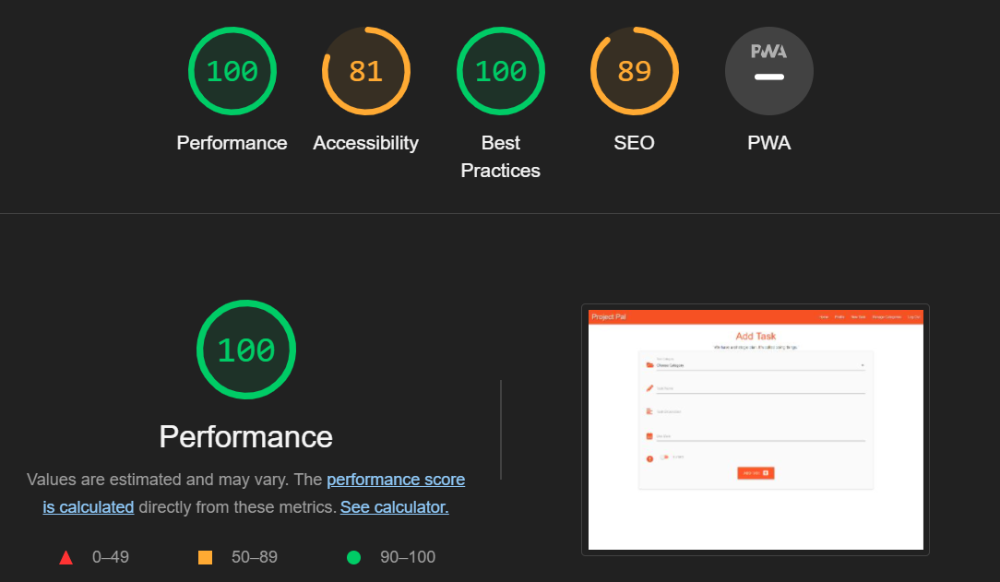
 
* Manage Categories
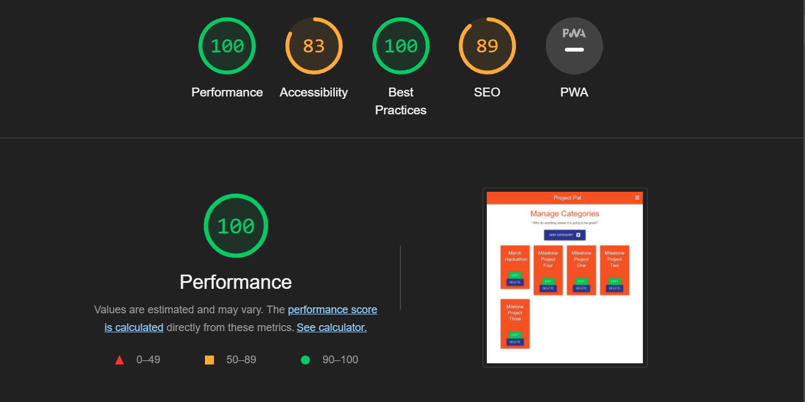
 
 
### User story testing
* The main user stories were as follows
  * create an attractive, responsive, easy to use task manager
  * Create a responsive application
  * Creat an easy ti navigate application
  * Simple register and login functionality
  * Simple UI
  * Simply task creation and deletion
* The above user story summary has been met, highlighting key points below
    * The application has a minimalist design which allows for easy navigation
    * The application is built on with 3 block colors and consistent design across each page which is easy on the eye
    * The CRUD functionality allows for easy to create and delete tasks as intended
* Feedback on Application
   * ___I really liked everything about the website, signing up was so easy and logging back in was also so easy. The design was simple but effective and I knew exactly what I could do with the website after a couple of seconds. Adding and completing tasks was easy and effective. It would be good to add subtasks in the future. Overall, the site was easy to use, visually pleasing, fit for purpose. I would use this website. Sarah Kay___
 
* As a first time visitor, I want to be able to register and login easily.
 * straight forward register and login in with validation fields to allow for a good UX to answer this user story
 
 
 
 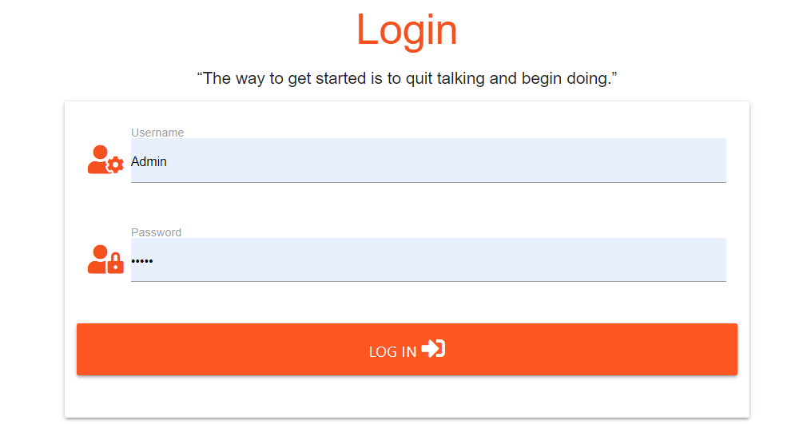
 
* As a first time visitor, I want the application to be attractive and easy to read.
  * 3 clock colors, with clear CTA, NAVBAR and footer to answer this user story
 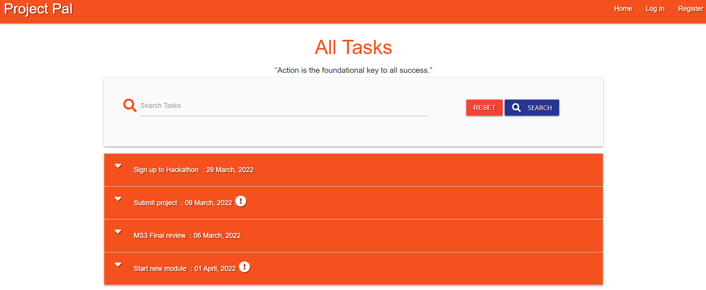
 
* As a first time visitor, I want the application to be responsive to whichever device I am using it on.
  * Application is responsive for different device types to allows users to use on any device that they want.
 
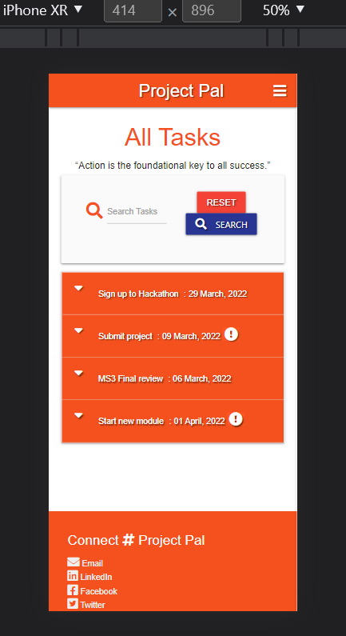
 
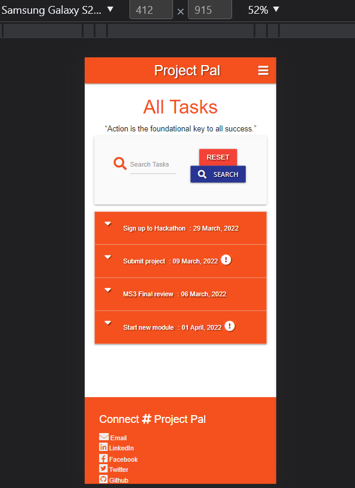
 
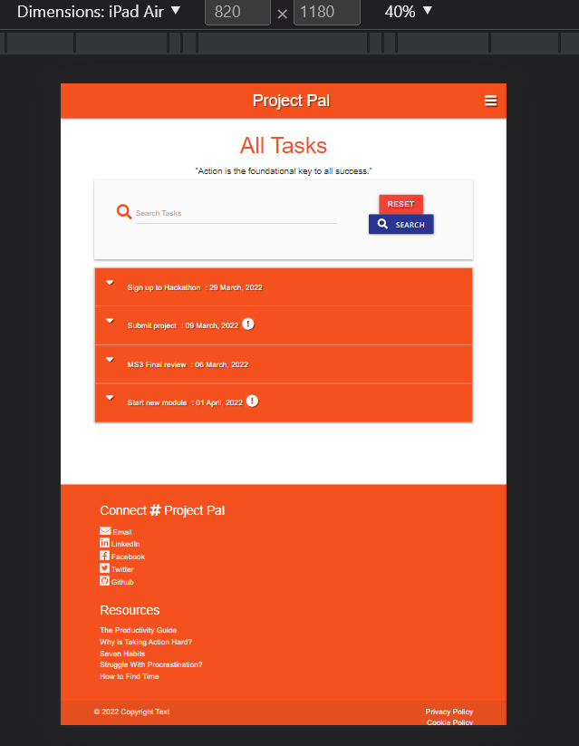
 
* As a first time visitor, I want to be able to navigate around the different pages of the application easily.
 * This user story was answered by including a Materialize Navbar and a mobile toggle nav-bar for a good UX
 
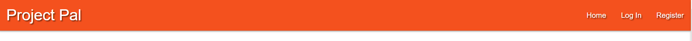
 
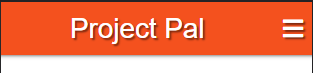
 
* As a first time visitor, I want to be able to clearly see my tasks that I have to do .
 * Clear, concise, easy to navigate to and use Task Manager
 
  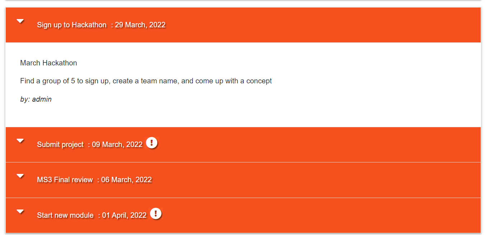
 
* As a first time visitor, I want to be given a choice of categories to add tasks to
 * This image shows the list of categories available for a standard user to choose from.
 
 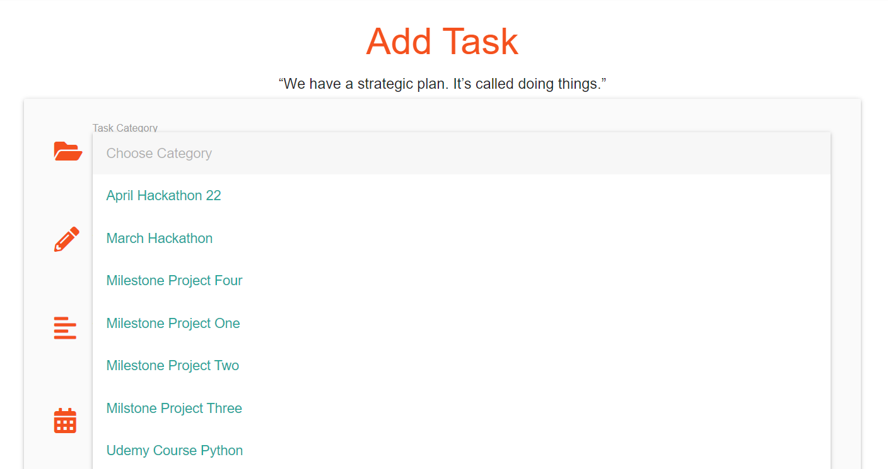
 
* As a site owner I want to create an application to work as intended, Create, Read, Update & Delete
* The CRUD functionality is set up on Tasks and Categories. The below image demonstrates that this user story has been answered
 
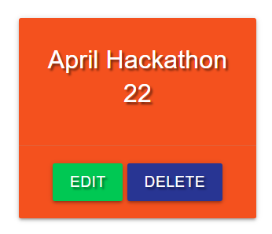
 
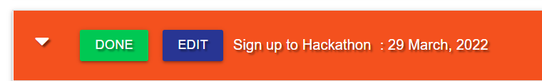
 
* As a first time Admin visitor, I want to be able to manage categories for the task manager.
 * Admins have additional functionality that allow them to manage categories, Create, Update and Delete. The below image demonstrates this user story has been answered
 
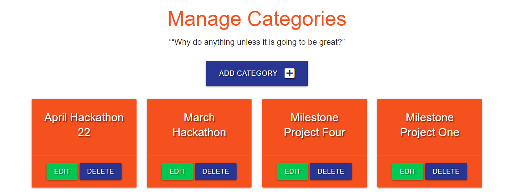
 
* As a returning user, I want to navigate search for tasks
  * Users of the application have the choice to search for tasks across the application so the can edit or complete their task
 
 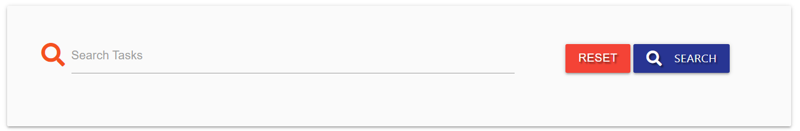
 
 
### Responsiveness
* The website was tested using the 'inspect' option available on Google and Internet explorer for different screen sizes and mobile. The following devices showed zero errors with responsiveness or format.
* **Devices:**
  * Samsung Galaxy S20
  * iPhone X
  * Lenovo IdeaPad S340-14IIL
  * Samsung A70
 
### Accessibility
* Google Lighthouse gave the website a score between 96% and 81% accessibility across different pages of the application
 
### Known Issues and Bugs
* Sometimes the text overlaps with the font awesome icon and the text line - refreshing the page resolves this. A fix is being worked in.
 
### Deployment
 
* This project used GitPod for developement, GitHub to storage the repository, Git for version control and deployed using Heroku.

### Forking the GitHub Repository

The repository can be forked on GitHub, this creates a copy of the repository that can be viewed or amended without affecting the original repository. This can be done using the following steps:

* Login to GitHub and locate the repository as before.
* At the top right of the repository (under your avatar) locate the Fork button and click this button.
* There should now be a copy of the repository in your own GitHub account, which you can amend.

### Cloning the GitHub Repository

A clone of the repository can be made, which will create a local copy on your own computer. Changes can be made to this local copy and it will not affect the original repository. Follow these steps to clone the Sunrise Yoga repository.

* Login to GitHub and locate the repository as before.
* Click the button called "Code".
* Under HTTPS copy the link provided, in this case (https://github.com/vanessacleary/project_pal_MS3).
* Go to Gitpod or whichever IDE you are using and open the Terminal.
* Change the current working directory to the location where you want the cloned directory to be made.
* Type 'git clone' followed by the url you copied in step 3.
* Press "Enter" to create the local clone.
* You can refer to the GitHub documentation for more detailed information on the above process [here](https://docs.github.com/en/repositories/creating-and-managing-repositories/cloning-a-repository).
* Follow steps in 'Create MongoDB Database', 'Environment Variables and Setting up the App' and 'Heroku and Deployment' for more information on what is required to run 'Project Pal.

### Create MongoDB Database

A MongoDB account will be required for this.

* Create a new database in MongoDB
* Within database you can create collections. 
* The collections within the database for this project are:
    * Categories
    * Tasks
    * Users

### Environment Variables and Setting up the App
* Create env.py file containing sensitive information and add to .gitignore.
* To connect MongoDB database and app, got to MongoDB cluster page and select 'connect'.
* Select 'Connect Your Application'
* Select the correct driver and Python version
* Copy the string and add to env.py file, populating password and database name.
* The env.py should contain the following: secret key, MongoDB URI and database name.
* [RandomKeygen](https://randomkeygen.com/) was used to generate the secret key.
      
* Create a requirements.txt file and Procfile by using these commands.
    

* These are both required by Heroku. Commit and push your repository.
* If working in a local copy, open terminal window in IDE and type python3 app.py and run the app.

### Heroku and Deployment
* A Heroku account will be required for this.

* Log into Heroku account and create a new app.
* Create an original name and choose the region closest.
* Go to Deploy tab and select your chosen deployment method. For this project GitHub was selected.
* Go to Settings and go to Config Vars and click to reveal Config Vars.
* Add environment variables, matching those entered into the env.py file. 
    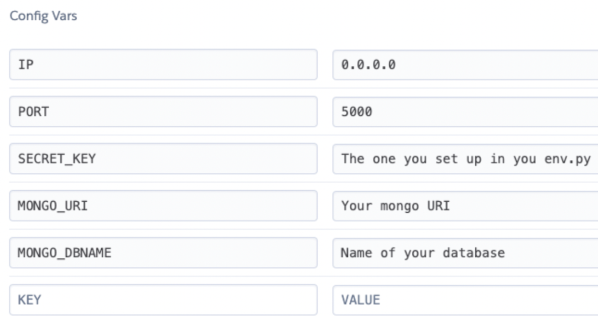
* Go back to Deploy and select Enable Automatic Deploys. Below you can select to deploy a branch in the manual deploy section.
* Click to Open App.
 
### Credits
* Code and Content
   * Materialize was used for the structure and layout of the site.
   * Google was used to find the images selected for the site.
   * Stackoverflow was used to help find solutions to the issues I had whilst building my project.
  * Code Institute mini task project was used a lot throughout the project to help with functionality across the site.
  * Websites I took articles from
     * [https://jamesclear.com/productivity](https://jamesclear.com/productivity)
     * [https://www.scotthyoung.com/blog/2019/12/16/why-is-action-hard/](https://www.scotthyoung.com/blog/2019/12/16/why-is-action-hard/)
 
### Acknowledgements
* Code Institute for providing endless help and resources to get me this far.
* Code Institute tutor support for pushing me and always supporting.
* My mentor Reuben Ferrante for the help and patience to guide me through my first data centric project.
* The Mini Feb 2021 group, wider slack community and the tutors for all the help, support and feedback for the last couple of weeks.
* Friends and Family who have taken their time to offer advice and feedback during the development of my project.
 
 
 

